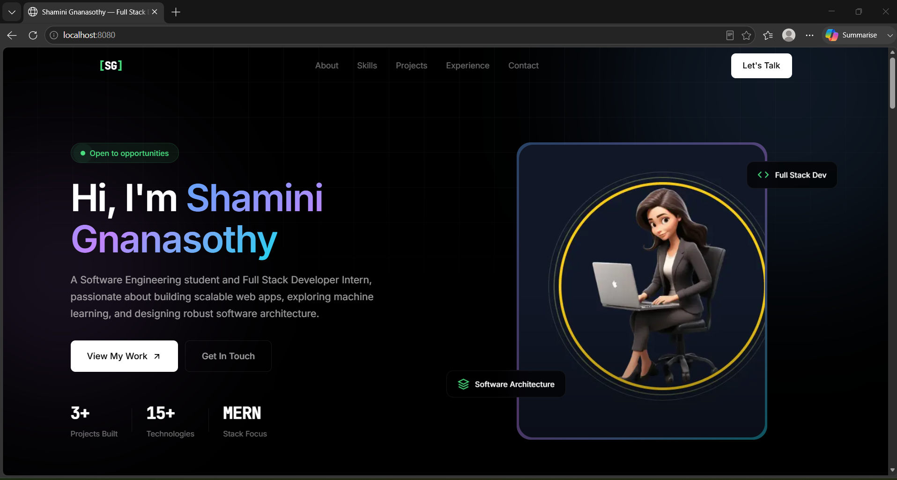

# Portfolio Website

A modern, responsive single-page portfolio website built with HTML, CSS, and JavaScript, containerized with Docker and served via Nginx.
---

## ✨ Features

* **Modern UI/UX:** Dark theme with vibrant gradient accents and subtle glow effects.
* **Fully Responsive:** Optimized for a seamless experience across mobile, tablet, and desktop screens.
* **Smooth Animations:** Engaging scroll-reveal effects, floating cards, and dynamic hover states.
* **Comprehensive Sections:** Includes Hero, About, Skills, Projects, Experience, and Contact sections.
* **Interactive Elements:** A functional contact form with simulated submission feedback.
* **Performance Optimized:** Configured for speed with Gzip compression and aggressive static asset caching.
* **Production-Ready Docker:** Utilizes a secure multi-stage build, runs as a non-root user, and includes health checks.

  


---

## 🛠️ Tech Stack

* **Frontend:** HTML5, CSS3, Vanilla JavaScript
* **Web Server:** Nginx (Production-optimized configuration)
* **Containerization:** Docker
* **Typography:** Google Fonts (Inter, JetBrains Mono)

---

## 🚀 Quick Start with Docker

### Prerequisites

Ensure you have [Docker](https://www.docker.com/) installed and running on your system.

### 1. Build the Image

Run the following command in your project root directory to build the Docker image:


docker build -t portfolio .
### Run the Container

```bash
docker run -d -p 8080:80 --name portfolio portfolio

```
### View the Site

Open your browser and navigate to:

```text
http://localhost:8080

```
### Stop the Container

```bash
docker stop portfolio
docker rm portfolio
